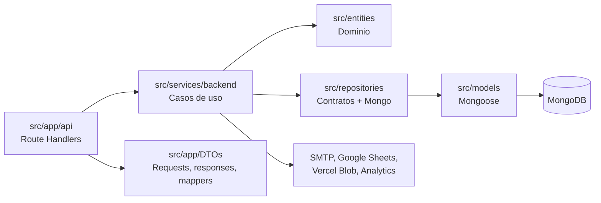

# LUFA Fantasy

Sistema de gestion para ligas de Flag Football construido con **Next.js**, **TypeScript** y **MongoDB**. La app permite administrar torneos, divisiones, equipos, jugadores, partidos, tabla de posiciones, rankings, registros publicos, Live Match y herramientas operativas para administradores.

## Documentacion Principal

- [Arquitectura del backend](docs/backend-architecture.md): capas, componentes, flujos de interaccion, endpoints, servicios, persistencia y guia para agregar features con clean code.
- [Propuesta LUFA Flag](docs/propuesta-lufa-flag.html): material comercial/institucional.
- [Sponsors 2026](docs/sponsors-2026/index.html): pagina estatica de sponsors.

## Stack

| Area | Tecnologia |
| --- | --- |
| Aplicacion | Next.js 15 App Router |
| UI | React 19, Tailwind CSS |
| Backend | Next.js Route Handlers |
| Lenguaje | TypeScript |
| Base de datos | MongoDB + Mongoose |
| Auth | JWT en cookie HTTP-only |
| Email | Nodemailer via SMTP |
| Storage | Vercel Blob |
| Deploy | Vercel |
| Integraciones | Google Sheets, Vercel Analytics, Vercel Flags |

## Funcionalidades

- Gestion de torneos, divisiones, equipos, jugadores y jueces.
- Programacion de partidos regulares, playoffs y finales.
- Live Match con eventos de partido, jugadores presentes, inicio, finalizacion y walkover.
- Tabla de posiciones viva para temporada regular con desempates IFAF.
- Rankings y estadisticas de jugadores/equipos.
- Registro, login, verificacion por OTP y reset de password.
- Panel admin para usuarios, settings, auditoria, intereses y health operativo.
- Correcciones de eventos enviadas por jueces y aprobadas/rechazadas por admin.
- Importacion idempotente de jugadores desde Google Sheets.
- Upload de imagenes a Vercel Blob.
- Crons para importacion y digest semanal.

## Arquitectura

El backend sigue una separacion por capas liviana:



Reglas rapidas para nuevas features:

- Mantener los handlers de `src/app/api` delgados.
- Poner reglas de negocio en `src/services/backend` o `src/entities`.
- Acceder a MongoDB mediante repositorios cuando sea dominio principal.
- Exponer respuestas mediante DTOs/mappers, no documentos Mongoose crudos.
- Invalidar cache tags cuando una mutacion afecte pantallas publicas.
- Auditar cambios admin sensibles.

La explicacion completa esta en [docs/backend-architecture.md](docs/backend-architecture.md).

## Estructura Del Proyecto

```text
src/
├── app/
│   ├── api/                 # Backend HTTP con Route Handlers
│   ├── DTOs/                # Requests, responses y mappers
│   └── */page.tsx           # Pantallas App Router
├── components/              # Componentes UI reutilizables
├── entities/                # Agregados y value objects del dominio
├── hooks/                   # Hooks React
├── lib/                     # Auth, MongoDB, cache, errores, settings y utilidades
├── models/                  # Schemas Mongoose
├── repositories/            # Contratos e implementaciones de persistencia
├── services/
│   ├── backend/             # Casos de uso del backend
│   └── frontend/            # Clientes API y servicios UI
└── types/                   # Tipos compartidos

scripts/                     # Tareas operativas y migraciones
docs/                        # Documentacion y artefactos
public/                      # Imagenes y assets publicos
```

## Requisitos

- Node.js 18 o superior.
- npm.
- MongoDB local o remoto.
- Cuenta/proyecto Vercel para deploy.
- Credenciales opcionales segun feature: SMTP, Vercel Blob, Google Sheets.

## Configuracion Local

1. Instalar dependencias:

```bash
npm install
```

2. Crear archivo de entorno:

```bash
cp .env.example .env.local
```

3. Configurar como minimo:

```env
environment=development
NEXT_PUBLIC_APP_URL=http://localhost:3000
MONGODB_URI=mongodb://localhost:27017/lufa_fantasy
JWT_SECRET=change-this-to-a-long-random-secret
```

4. Ejecutar en desarrollo:

```bash
npm run dev
```

La app queda disponible en `http://localhost:3000`.

## Variables De Entorno

| Variable | Uso |
| --- | --- |
| `environment` | Selecciona base Mongo: `production` usa `prod`; cualquier otro valor usa `test`. |
| `NEXT_PUBLIC_APP_URL` | URL publica para links de verificacion/notificaciones. |
| `MONGODB_URI` | Conexion MongoDB. |
| `JWT_SECRET` | Firma de sesiones JWT. |
| `OTP_SECRET` | Pepper para OTPs. Si falta, se usa `JWT_SECRET`. |
| `MAIL_FROM`, `MAIL_PROVIDER`, `SMTP_HOST`, `SMTP_PORT`, `SMTP_SECURE`, `SMTP_USER`, `SMTP_PASS` | Envio de emails. |
| `BLOB_READ_WRITE_TOKEN` | Uploads a Vercel Blob. |
| `FLAGS`, `FLAGS_SECRET` | Feature flags de Vercel. |
| `CRON_SECRET` | Proteccion de endpoints cron. |
| `GOOGLE_SHEETS_SPREADSHEET_ID`, `GOOGLE_SHEETS_TAB_NAME`, `GOOGLE_SERVICE_ACCOUNT_EMAIL`, `GOOGLE_PRIVATE_KEY` | Importacion desde Google Sheets. |

Ver [.env.example](.env.example) para el listado completo.

## Scripts

| Script | Descripcion |
| --- | --- |
| `npm run dev` | Inicia Next.js en desarrollo con Turbopack. |
| `npm run build` | Compila la app para produccion. |
| `npm start` | Sirve la build de produccion. |
| `npm run lint` | Ejecuta lint configurado en el proyecto. |
| `npm run seed` | Ejecuta seed con `.env`. |
| `npm run db:migrate-game-events` | Migra eventos de partidos. |
| `npm run db:sync-test-from-prod` | Sincroniza base de test desde produccion. |
| `npm run vercel:pull:testing` | Descarga env vars de Vercel Preview. |
| `npm run vercel:pull:prod` | Descarga env vars de Vercel Production. |
| `npm run deploy:testing` | Deploy manual a Vercel Preview. |
| `npm run deploy:prod` | Deploy manual a Vercel Production. |

## Endpoints Principales

| Grupo | Rutas |
| --- | --- |
| Auth | `/api/auth/login`, `/api/auth/register`, `/api/auth/me`, `/api/auth/logout`, `/api/auth/verify-registration`, `/api/auth/password-reset/*` |
| Torneos | `/api/tournaments`, `/api/tournaments/[id]` |
| Divisiones | `/api/divisions` |
| Equipos | `/api/teams`, `/api/teams/[id]`, `/api/teams/[id]/players` |
| Jugadores | `/api/players`, `/api/players/[id]` |
| Partidos | `/api/games`, `/api/games/[id]`, `/api/games/[id]/start`, `/api/games/[id]/complete`, `/api/games/[id]/walkover`, `/api/games/[id]/events` |
| Estadisticas | `/api/dashboard`, `/api/standings`, `/api/rankings/players`, `/api/statistics/players`, `/api/statistics/teams` |
| Admin | `/api/admin/*` |
| Operativo | `/api/health`, `/api/media/upload`, `/api/cron/import-players`, `/api/cron/weekly-digest` |

El detalle metodo por metodo esta en [docs/backend-architecture.md](docs/backend-architecture.md#rutas-api).

## Deploy En Vercel

El proyecto soporta entornos paralelos:

- **Testing**: Vercel Preview, normalmente desde una rama `testing`.
- **Produccion**: Vercel Production, normalmente desde `main`.

Preparacion inicial:

```bash
npm i -g vercel
vercel login
vercel link
```

Configurar variables requeridas en Preview y Production:

```bash
vercel env add MONGODB_URI preview
vercel env add MONGODB_URI production
vercel env add JWT_SECRET preview
vercel env add JWT_SECRET production
```

Deploy manual:

```bash
npm run deploy:testing
npm run deploy:prod
```

Recomendacion operativa:

- Usar `testing` para previews estables.
- Usar `main` para produccion.
- Revisar que `environment=production` solo este en el entorno productivo, porque decide la base Mongo `prod`.

## Crons

El backend espera estos procesos programados:

| Ruta | Schedule | Funcion |
| --- | --- | --- |
| `/api/cron/import-players` | `0 6 * * *` | Importacion diaria de jugadores desde Google Sheets. |
| `/api/cron/weekly-digest` | `0 8 * * 1` | Digest semanal. |

Los endpoints cron deben recibir el secreto configurado en `CRON_SECRET`.

## Modelo De Dominio

Relaciones principales:

```text
Tournament (1) -> (N) Division
Tournament (1) -> (N) Team participante
Division (1) -> (N) Team
Team (1) -> (N) Player
Tournament + Division (1) -> (N) Game
Game (1) -> (N) GameEvent
Tournament + Division + Team (1) -> (1) Standing
User (1) -> roles y permisos
```

Agregados principales:

- `Tournament`: temporada, formato, criterios de playoff, divisiones y equipos participantes.
- `Division`: categoria competitiva.
- `Team`: equipo, coaches, colores, contacto e imagenes.
- `Player`: datos personales, equipo, posicion, camiseta y estado.
- `Game`: partido, estado, fase, jueces, score, eventos y jugadores presentes.
- `Standing`: tabla de posiciones, record, puntos, racha y desempates.
- `User`: identidad, roles, estado activo y permisos.

## Desarrollo De Nuevas Features

Checklist corto:

1. Definir el comportamiento de negocio.
2. Actualizar entidades/value objects si cambia el dominio.
3. Agregar o extender contratos de repositorio si se necesita persistencia.
4. Implementar queries Mongo en `src/repositories/mongodb`.
5. Crear o extender un servicio backend.
6. Definir DTOs y mappers.
7. Agregar route handler.
8. Validar auth/permisos.
9. Usar `apiErrorResponse()` para errores.
10. Invalidar cache y registrar auditoria cuando aplique.

## Estado De Calidad

- El proyecto compila con TypeScript estricto.
- No hay suite de tests automatizados declarada en `package.json`.
- Para cambios de backend sensibles, validar al menos con `npm run build`.
- La documentacion profunda de arquitectura identifica deuda y zonas de riesgo en [docs/backend-architecture.md](docs/backend-architecture.md#estado-actual-y-deuda-arquitectonica).

## Autor

Proyecto personal para la gestion de LUFA Flag y practica de desarrollo full-stack con TypeScript.
