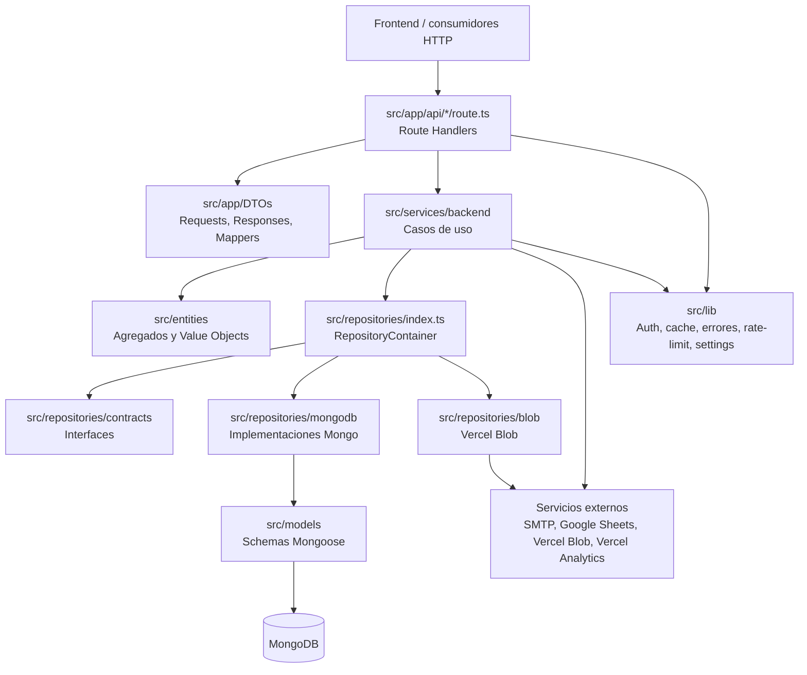
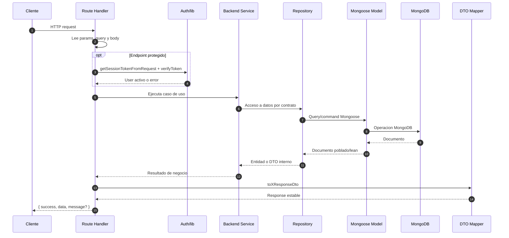
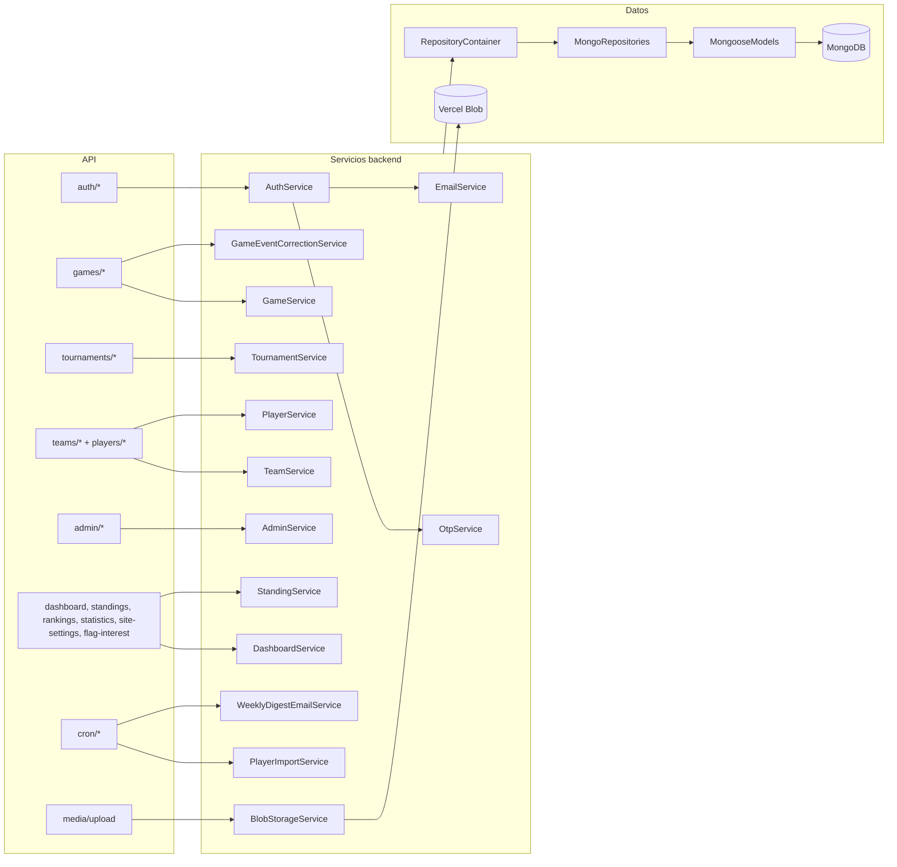
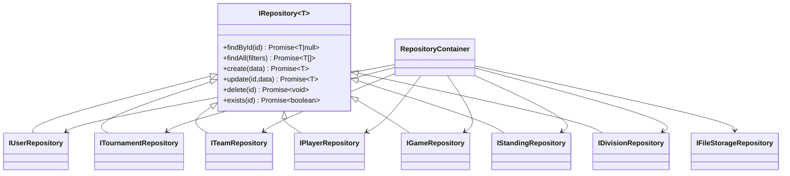
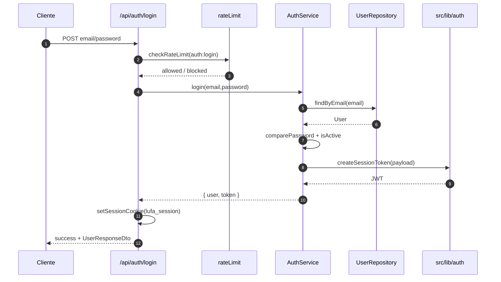
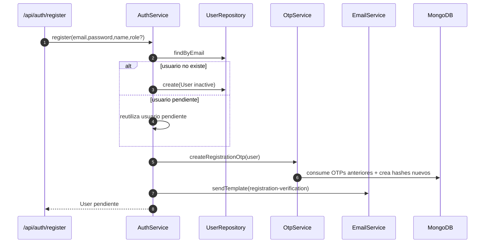
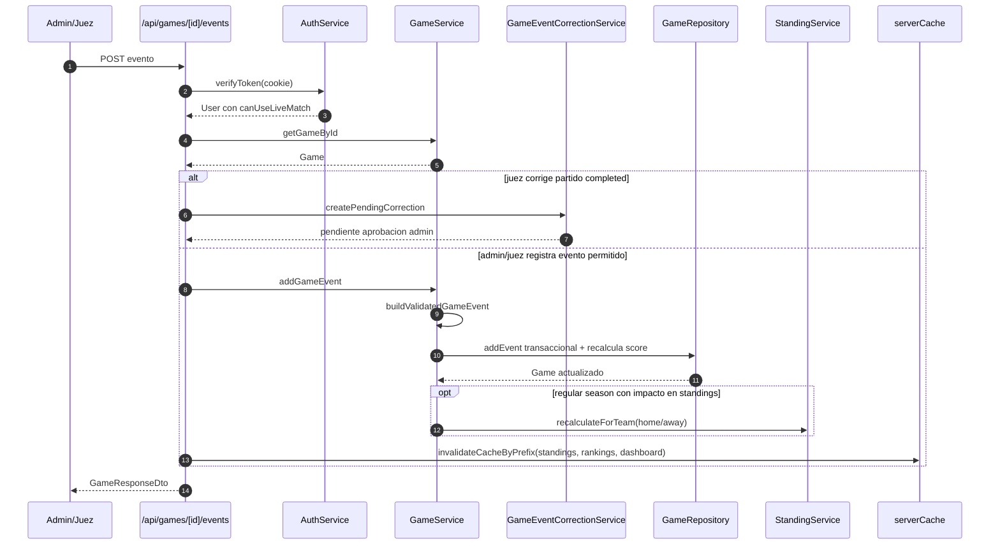
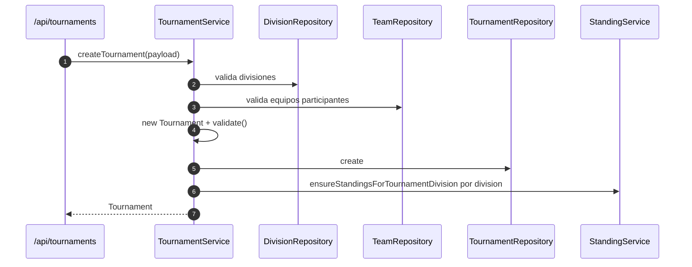
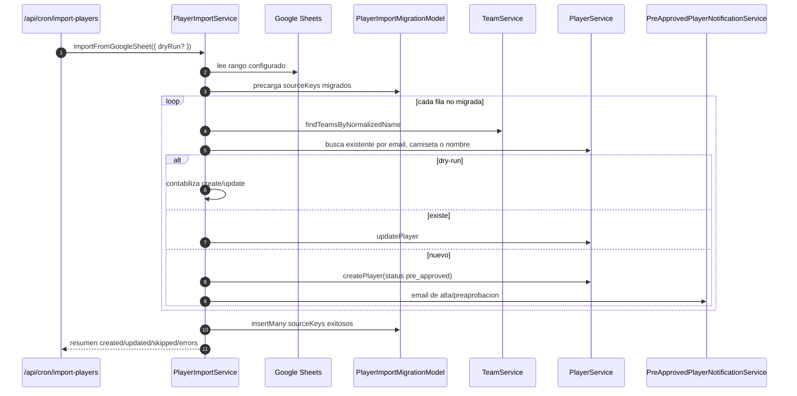

# Arquitectura del Backend

Este documento describe como esta organizado el backend de LUFA Fantasy y como extenderlo sin romper las reglas de negocio existentes. Esta pensado para futuros agentes y desarrolladores que necesiten agregar features con codigo limpio.

## Resumen Ejecutivo

LUFA Fantasy es una aplicacion Next.js 15 con App Router. El backend vive dentro de `src/app/api` como Route Handlers y delega la logica principal a servicios en `src/services/backend`. La persistencia usa MongoDB con Mongoose, encapsulada mayormente por contratos de repositorio en `src/repositories/contracts` e implementaciones Mongo en `src/repositories/mongodb`.

La arquitectura actual se parece a una Clean Architecture liviana:

- `API Routes`: borde HTTP, parseo de requests, auth por cookie, respuestas JSON y mapeo a DTOs.
- `Services`: casos de uso y reglas de aplicacion.
- `Entities`: modelo de dominio, invariantes y value objects.
- `Repositories`: contratos de acceso a datos e implementaciones MongoDB.
- `Models`: schemas Mongoose y detalles de persistencia.
- `Lib`: utilidades transversales como auth JWT, conexion Mongo, cache, rate-limit y errores.

## Diagrama De Capas



## Estructura Backend

| Carpeta | Responsabilidad | Regla para extender |
| --- | --- | --- |
| `src/app/api` | Handlers HTTP de Next.js. Extraen params/body, validan lo minimo, verifican permisos y devuelven JSON. | Mantener handlers delgados. No duplicar reglas de negocio aca. |
| `src/app/DTOs/Requests` | Contratos de entrada HTTP. | Agregar/actualizar DTOs cuando cambia el shape del request. |
| `src/app/DTOs/Responses` | Contratos de salida HTTP. | No exponer entidades ni documentos Mongoose crudos. |
| `src/app/DTOs/Mappers` | Conversion de entidades/documentos a responses. | Centralizar transformaciones de salida aca. |
| `src/services/backend` | Casos de uso, orquestacion y reglas de negocio. | Nueva feature de backend empieza aca, salvo que sea solo lectura trivial. |
| `src/entities` | Agregados, value objects, tipos de dominio e invariantes. | Agregar reglas estables del negocio en entidades/value objects. |
| `src/repositories/contracts` | Interfaces de persistencia. | Definir contrato antes de depender de Mongo en servicios nuevos. |
| `src/repositories/mongodb` | Queries Mongoose y transformacion persistencia-dominio. | Encapsular `populate`, transacciones y queries complejas aca. |
| `src/models` | Schemas Mongoose. | Cambios de estructura persistida van aca y deben reflejarse en entidades/mappers si aplica. |
| `src/lib` | Utilidades compartidas. | Solo logica transversal. Evitar meter casos de uso de negocio. |

## Flujo De Request



## Componentes Principales



## Dominio

Las entidades son clases inmutables desde el punto de vista publico: sus propiedades son `readonly` y las modificaciones suelen construir una nueva instancia o pasar por servicios. Todas las entidades raiz extienden `AggregateRoot` y exponen `validate()`.

| Agregado / Value Object | Archivo | Responsabilidad |
| --- | --- | --- |
| `User` | `src/entities/User.ts` | Identidad, roles (`user`, `admin`, `juez`, `entrenador_juveniles`), estado activo, hash/compare de password, permisos de Live Match. |
| `Tournament` | `src/entities/Tournament.ts` | Temporada, fechas, formato, criterios de playoff, divisiones y equipos participantes. |
| `Division` | `src/entities/Division.ts` | Categoria de competencia y equipos asociados. |
| `Team` | `src/entities/Team.ts` | Equipo, coaches, colores, contacto, imagenes, division y torneo. |
| `Player` | `src/entities/Player.ts` | Datos del jugador, equipo, posicion, camiseta, contacto, estado y validaciones. |
| `Game` | `src/entities/Game.ts` | Partido, estado, fase, equipos, jueces, venue, score, jugadores presentes y eventos. |
| `Standing` | `src/entities/Standing.ts` | Registro competitivo por equipo: wins/losses/ties, puntos, posicion, racha y ultimos juegos. |
| `Venue` | `src/entities/valueObjects/Venue.ts` | Nombre y direccion del lugar de juego. |
| `GameScore` / `QuarterScore` | `src/entities/valueObjects/Score.ts` | Score por cuartos, overtime, total y ganador. |
| `Colors`, `ContactInfo`, `TeamStatistics` | `src/entities/valueObjects` | Objetos de valor reutilizables del dominio. |

Regla importante: si una regla define que algo "puede" o "no puede" existir en el negocio, debe vivir en una entidad/value object o en un servicio. Los handlers HTTP solo deben validar formato minimo y traducir errores.

## Servicios Backend

| Servicio | Responsabilidad | Dependencias relevantes |
| --- | --- | --- |
| `AuthService` | Login, registro, verificacion de sesion, verificacion admin/Live Match y reset de password. | `UserRepository`, `OtpService`, `EmailService`, `src/lib/auth`. |
| `OtpService` | OTPs para verificacion de email y reset de password, hashing HMAC, expiracion, intentos y consumo. | `OtpVerificationModel`, `UserRepository`, JWT. |
| `EmailService` | Envio SMTP y templates de email. En desarrollo usa `jsonTransport` si faltan credenciales. | Nodemailer, env SMTP. |
| `TournamentService` | Crear/actualizar/listar/eliminar torneos, validar divisiones/equipos y crear standings iniciales. | Tournament, Division, Team repositories, `StandingService`. |
| `DivisionService` | CRUD de divisiones y asignacion/remocion de equipos. | Division repository. |
| `TeamService` | CRUD de equipos, normalizacion de coaches, colores y contacto. | Team repository. |
| `PlayerService` | CRUD/listado/busqueda de jugadores, validacion de equipo y camiseta unica por equipo. | Player y Team repositories. |
| `GameService` | Crear/actualizar partidos, Live Match, eventos, marcador, walkover, start/complete y recalculo de standings. | Game y Team repositories, `StandingService`. |
| `GameEventCorrectionService` | Correcciones propuestas por jueces sobre partidos completados y aprobacion/rechazo por admin. | `GameService`, `GameEventCorrectionModel`. |
| `StandingService` | Live standings, recalculo por equipo/division y desempates IFAF. | Standing, Game, Tournament y Team repositories. |
| `DashboardService` | Estadisticas agregadas del dashboard publico/admin. | Modelos Mongoose. |
| `AdminService` | Usuarios admin, settings, intereses, auditoria, health check y dry-run de importacion. | Modelos Mongoose, `PlayerImportService`. |
| `PlayerImportService` | Importacion idempotente desde Google Sheets, parseo de filas, matching de jugadores y notificaciones. | Google APIs, Player/Team services, `PlayerImportMigrationModel`. |
| `BlobStorageService` | Validacion y persistencia de uploads de imagenes. | `IFileStorageRepository`, Vercel Blob. |
| `WeeklyDigestEmailService` | Digest semanal por cron. | `EmailService`, `DashboardService`, modelos. |

### Servicios Que Usan Modelos Directamente

La ruta preferida es `Service -> Repository contract -> Mongo repository -> Mongoose model`. Existen excepciones actuales:

- `AdminService`: usa modelos directos para consultas agregadas, settings, auditoria y health.
- `DashboardService`: usa modelos directos para estadisticas agregadas.
- `PlayerImportService`: usa `PlayerImportMigrationModel` para idempotencia de importacion.
- `OtpService`: usa `OtpVerificationModel` para OTPs.
- Algunas rutas de estadisticas/rankings consultan modelos o helpers directamente por performance y agregacion.

Para features nuevas, preferir repositorios cuando la logica pertenezca al dominio principal. Usar modelos directos solo para lectura agregada, tareas operativas o documentos auxiliares sin entidad de dominio clara.

## Persistencia



`src/lib/mongodb.ts` cachea la conexion Mongoose en `global.mongoose` para evitar reconexiones durante hot reload. El nombre de base se decide con `process.env.environment`: `production` usa `prod`; cualquier otro valor usa `test`.

### Modelos Mongoose

| Modelo | Uso principal |
| --- | --- |
| `UserModel` | Usuarios, roles, estado activo, password hash. |
| `TournamentModel` | Torneos, divisiones y equipos participantes. |
| `DivisionModel` | Divisiones. |
| `TeamModel` | Equipos, coaches, colores, contacto e imagenes. |
| `PlayerModel` | Jugadores y estado de inscripcion. |
| `GameModel` | Partido base, status, score, equipos, jueces y jugadores presentes. |
| `GameEventModel` | Eventos Live Match separados del documento de partido. |
| `StandingModel` | Tabla de posiciones por equipo/torneo/division. |
| `GameEventCorrectionModel` | Correcciones pendientes/aprobadas/rechazadas. |
| `OtpVerificationModel` | OTPs hasheados, expiracion, intentos y consumo. |
| `AdminAuditLogModel` | Auditoria de cambios admin. |
| `FlagInterestModel` | Intereses del formulario "sumate"/sponsors. |
| `SiteSettingsModel` | Configuracion publica/admin del sitio. |
| `PlayerImportMigrationModel` | Idempotencia de importacion desde Google Sheets. |
| `JudgeModel` | Jueces/oficiales. |
| `PlayerStatisticsModel`, `TeamStatisticsModel`, `SeasonModel`, `VenueModel` | Datos de estadisticas/soporte presentes en el modelo de datos. |

## Rutas API

Todas las respuestas intentan seguir este contrato:

```ts
{
  success: boolean;
  data?: unknown;
  message?: string;
  pagination?: unknown;
  error?: string;
}
```

Para errores, usar `apiErrorResponse()` de `src/lib/apiError.ts` para log consistente y shape estable.

### Publicas Y Lectura

| Metodo | Ruta | Responsabilidad |
| --- | --- | --- |
| `GET` | `/api/health` | Health publico de la app. |
| `GET` | `/api/site-settings` | Settings publicos del sitio. |
| `GET` | `/api/dashboard` | Estadisticas del dashboard. |
| `GET` | `/api/standings` | Tabla de posiciones por torneo/division. |
| `GET` | `/api/rankings/players` | Rankings de jugadores. |
| `GET` | `/api/statistics/players` | Estadisticas de jugadores. |
| `GET`, `POST` | `/api/statistics/teams` | Estadisticas de equipos. |
| `POST` | `/api/flag-interest` | Alta de interes desde formulario publico. |
| `GET` | `/api/flag-interest/player-registrations` | Lectura de registros de jugadores/interes. |

### Autenticacion

| Metodo | Ruta | Responsabilidad |
| --- | --- | --- |
| `POST` | `/api/auth/login` | Login con rate-limit, JWT y cookie `lufa_session`. |
| `POST` | `/api/auth/logout` | Limpia cookie de sesion. |
| `GET` | `/api/auth/me` | Devuelve usuario autenticado. |
| `POST` | `/api/auth/register` | Registro con OTP de verificacion. |
| `POST` | `/api/auth/verify-registration` | Verifica OTP y activa usuario. |
| `POST` | `/api/auth/password-reset/request` | Genera OTP de reset si el usuario activo existe. |
| `POST` | `/api/auth/password-reset/confirm` | Valida OTP y cambia password. |

### Torneos, Divisiones, Equipos Y Jugadores

| Metodo | Ruta | Responsabilidad |
| --- | --- | --- |
| `GET`, `POST` | `/api/tournaments` | Lista/crea torneos. |
| `GET`, `PUT`, `DELETE` | `/api/tournaments/[id]` | Lee/actualiza/elimina torneo. |
| `GET`, `POST` | `/api/divisions` | Lista/crea divisiones. |
| `GET`, `OPTIONS`, `POST` | `/api/teams` | Lista/crea equipos. |
| `GET`, `PUT`, `DELETE` | `/api/teams/[id]` | Lee/actualiza/elimina equipo. |
| `POST` | `/api/teams/[id]/players` | Agrega jugador preaprobado a un equipo y notifica. |
| `GET`, `POST` | `/api/players` | Lista/crea jugadores. |
| `GET`, `PUT`, `DELETE` | `/api/players/[id]` | Lee/actualiza/elimina jugador. |
| `GET`, `POST` | `/api/judges` | Lista/crea jueces. |

### Partidos Y Live Match

| Metodo | Ruta | Responsabilidad |
| --- | --- | --- |
| `GET`, `POST`, `PUT` | `/api/games` | Lista/crea/actualiza partidos. |
| `GET`, `PUT`, `DELETE` | `/api/games/[id]` | Lee/actualiza/elimina partido. |
| `PATCH` | `/api/games/[id]/start` | Inicia partido con jugadores presentes. |
| `PATCH` | `/api/games/[id]/complete` | Completa partido y recalcula standings. |
| `PATCH` | `/api/games/[id]/walkover` | Marca walkover 14-0 y completa partido. |
| `POST` | `/api/games/[id]/events` | Registra evento Live Match. |
| `PATCH`, `DELETE` | `/api/games/[id]/events/[eventId]` | Edita/elimina evento o crea correccion pendiente si corresponde. |

### Admin

| Metodo | Ruta | Responsabilidad |
| --- | --- | --- |
| `GET` | `/api/admin/stats` | Estadisticas del panel admin. |
| `GET` | `/api/admin/system-health` | Checks de env, cron y rutas operativas. |
| `GET` | `/api/admin/users` | Lista usuarios admin. |
| `PATCH` | `/api/admin/users/[id]` | Cambia rol/estado de usuario y audita. |
| `GET`, `PATCH` | `/api/admin/settings` | Lee/actualiza settings del sitio y audita. |
| `GET` | `/api/admin/audit-logs` | Lista auditoria. |
| `GET` | `/api/admin/flag-interests` | Lista intereses recibidos. |
| `GET` | `/api/admin/game-event-corrections` | Lista correcciones pendientes. |
| `PATCH` | `/api/admin/game-event-corrections/[id]` | Aprueba/rechaza correccion. |
| `POST` | `/api/admin/player-import/dry-run` | Simula importacion desde Google Sheets y audita. |

### Operativas

| Metodo | Ruta | Responsabilidad |
| --- | --- | --- |
| `GET` | `/api/cron/import-players` | Importacion programada desde Google Sheets protegida por `CRON_SECRET`. |
| `GET` | `/api/cron/weekly-digest` | Digest semanal protegido por `CRON_SECRET`. |
| `POST` | `/api/media/upload` | Upload de imagenes a Vercel Blob con auth y validaciones. |

## Interacciones Clave

### Login Y Sesion



### Registro Con OTP



### Live Match Y Standings



### Crear Torneo



### Importacion Desde Google Sheets



## Autenticacion Y Permisos

La sesion se guarda en cookie HTTP-only `lufa_session`, firmada como JWT con `JWT_SECRET`.

Roles actuales:

| Rol | Uso |
| --- | --- |
| `user` | Usuario normal. |
| `admin` | Administracion completa y Live Match. |
| `juez` | Puede usar Live Match. Si corrige partido completado, crea correccion pendiente. |
| `entrenador_juveniles` | Rol administrativo limitado/operativo para juveniles. |

Helpers principales:

- `getSessionTokenFromRequest(request)`: lee cookie.
- `AuthService.verifyToken(token)`: valida JWT, usuario existente y activo.
- `User.isAdmin()`: autorizacion admin.
- `User.canUseLiveMatch()`: admin o juez activo.
- `setSessionCookie()` y `clearSessionCookie()`: manejo central de cookie.

Regla: cada route protegida debe validar auth explicitamente. No hay middleware global de permisos para API.

## Errores, Cache Y Rate Limit

### Errores

Usar `apiErrorResponse()` en handlers nuevos. Para `5xx` loguea contexto de request y stack; para `4xx` loguea warning. El cliente recibe `{ success: false, message }` y opcionalmente `error` si se pasa `exposeError`.

### Cache

`src/lib/serverCache.ts` ofrece:

- `buildRequestCacheKey(namespace, searchParams)`: key estable ordenando query params.
- `getCachedValue(key, ttlMs, loader, { tags })`: wrapper de `unstable_cache`.
- `invalidateCacheByPrefix(prefixes)`: llama `revalidateTag`.
- `createCacheHeaders(ttlSeconds)`: headers privados con TTL.

Cuando una mutacion afecta datos publicos, invalidar tags relacionados. Ejemplos actuales: jugadores y eventos invalidan `teams`, `dashboard`, `standings`, `rankings`.

### Rate Limit

`src/lib/rateLimit.ts` mantiene un rate-limit en memoria por IP. Actualmente se usa en login con limite de 4 intentos por minuto. En serverless esto es best-effort por instancia; no reemplaza un rate-limit distribuido si el trafico crece.

## Reglas De Negocio Sensibles

### Standings

`StandingService` calcula standings como live standings: cuentan partidos `in_progress` y `completed`, solo de fase `regular`. Playoffs/finales no afectan tabla regular.

Ordenamiento:

1. Porcentaje de victorias total.
2. Desempates IFAF por subgrupos:
   - porcentaje head-to-head;
   - diferencial head-to-head;
   - puntos a favor head-to-head;
   - diferencial total;
   - puntos a favor total.

No modificar `StandingService` sin revisar `GameService.hasStandingsImpact()` y los flujos de eventos, score, start, complete y walkover.

### Live Match

`GameService.buildValidatedGameEvent()` valida:

- cuarto entre 1 y 5;
- tipo requerido;
- equipo requerido;
- jugador requerido salvo eventos de cierre y algunos `safety` con QB en `details`;
- el equipo del evento debe participar en el partido;
- puntos negativos se normalizan a cero.

`MongoGameRepository` guarda eventos en `GameEventModel`, no embebidos directamente en `GameModel`. Al agregar/editar/eliminar eventos, recalcula el score almacenado en la misma transaccion.

### Correcciones De Eventos

Jueces pueden proponer correcciones sobre partidos completados. Esas correcciones se guardan como pendientes y un admin debe aprobar/rechazar. La aprobacion aplica el cambio mediante `GameService`, por lo que mantiene validaciones, score y standings.

### Torneos

Al crear torneo se validan:

- divisiones existentes;
- al menos un equipo participante;
- al menos una division;
- cada equipo participante pertenece a una de las divisiones seleccionadas.

Despues de persistir, se crean standings iniciales por division/equipo participante.

### Jugadores

`PlayerService` valida equipo existente y camiseta unica dentro del equipo si se informa numero. La importacion desde Google Sheets intenta matchear por email, luego camiseta en equipo, luego nombre normalizado dentro del equipo.

### Admin

`AdminService.updateUser()` impide:

- roles invalidos;
- que un admin se quite a si mismo el rol admin;
- que un admin se desactive a si mismo;
- dejar el sistema sin ningun admin activo.

Todo cambio admin relevante debe registrar auditoria con `recordAudit()`.

## Variables De Entorno

| Variable | Uso |
| --- | --- |
| `environment` | Decide base Mongo: `production` -> `prod`; otros -> `test`. |
| `NEXT_PUBLIC_APP_URL` / `APP_URL` | URLs publicas en OTPs/notificaciones. |
| `MONGODB_URI` | Conexion MongoDB. |
| `JWT_SECRET` | Firma de JWT de sesion. |
| `OTP_SECRET` | Pepper para OTPs; si falta se usa `JWT_SECRET`. |
| `MAIL_FROM`, `MAIL_PROVIDER`, `SMTP_HOST`, `SMTP_PORT`, `SMTP_SECURE`, `SMTP_USER`, `SMTP_PASS` | Envio de emails. |
| `BLOB_READ_WRITE_TOKEN` | Uploads a Vercel Blob. |
| `FLAGS`, `FLAGS_SECRET` | Feature flags Vercel. |
| `CRON_SECRET` | Proteccion de endpoints cron. |
| `GOOGLE_SHEETS_SPREADSHEET_ID`, `GOOGLE_SHEETS_TAB_NAME`, `GOOGLE_SERVICE_ACCOUNT_EMAIL`, `GOOGLE_PRIVATE_KEY` | Importacion desde Google Sheets. |

## Crons

Endpoints esperados por el backend:

| Ruta | Schedule esperado | Funcion |
| --- | --- | --- |
| `/api/cron/import-players` | `0 6 * * *` | Importacion diaria de jugadores. |
| `/api/cron/weekly-digest` | `0 8 * * 1` | Digest semanal. |

Nota operativa: `AdminService.getSystemHealth()` espera ambos crons. Al momento de esta documentacion, `vercel.json` configura `/api/cron/import-players` diario y otro semanal duplicado para la misma ruta. Si se quiere activar el digest semanal, ajustar `vercel.json` para apuntar a `/api/cron/weekly-digest`.

## Guia Para Agregar Una Feature Backend

1. Definir el comportamiento en terminos de dominio.
2. Si cambia el modelo de negocio, actualizar o crear entidad/value object en `src/entities`.
3. Si necesita persistencia, agregar metodo al contrato en `src/repositories/contracts`.
4. Implementar el metodo en `src/repositories/mongodb` usando Mongoose.
5. Exponer la implementacion desde `RepositoryContainer` si es un repositorio nuevo.
6. Crear o extender un servicio en `src/services/backend` con la regla de negocio.
7. Crear DTOs de request/response en `src/app/DTOs`.
8. Agregar mapper en `src/app/DTOs/Mappers` para no filtrar entidades ni documentos crudos.
9. Crear/editar route handler en `src/app/api`.
10. Proteger con `AuthService` cuando corresponda.
11. Usar `apiErrorResponse()` y status HTTP coherentes.
12. Invalidar cache tags si la mutacion afecta pantallas publicas.
13. Registrar auditoria si es una accion admin sensible.
14. Verificar con `npm run build` o, como minimo, `npx tsc --noEmit` si el build completo no aplica.

## Convenciones De Codigo Limpio

- Handlers HTTP delgados: request, auth, llamada a servicio, mapper, response.
- Servicios contienen casos de uso y reglas, no detalles HTTP.
- Repositorios contienen queries y detalles Mongoose, no decisiones de negocio.
- Entidades validan invariantes propias y exponen metodos semanticos (`canUseLiveMatch`, `canStart`, `validate`).
- DTOs son el contrato publico. No devolver documentos Mongoose directamente.
- Mantener imports con alias `@/` cuando el codigo local ya lo usa.
- Al agregar filtros, preferir que el servicio reciba un objeto tipado y el repositorio haga la query eficiente.
- Al modificar partidos, revisar impactos en score, eventos, standings y cache.
- Al modificar usuarios/admin/settings, revisar auditoria y permisos.
- Al tocar crons/importacion, preservar idempotencia: una fila exitosa no debe reprocesarse.

## Checklist De Riesgo Por Area

| Area | Revisar antes de cambiar |
| --- | --- |
| Auth | Cookie `lufa_session`, `JWT_SECRET`, usuario activo, status HTTP 401/403. |
| OTP | Expiracion, consumo unico, intentos maximos, hashing con pepper. |
| Games | Estados permitidos, equipos participantes, eventos, score derivado, standings y playoff slots. |
| Standings | Solo regular season, `in_progress`/`completed`, desempates por subgrupos. |
| Tournaments | Divisiones/equipos participantes y standings iniciales. |
| Players | Equipo existente, camiseta unica, estados (`active`, `pre_approved`, etc.). |
| Admin | No dejar sin admin activo, registrar auditoria. |
| Cache | Invalidar tags tras mutaciones que afecten listados o dashboards. |
| Imports | Dry-run, idempotencia por `sourceKey`, manejo de filas ambiguas. |
| Media | Tipo/tamano de archivo, auth y permisos de actualizacion del recurso asociado. |

## Archivos De Entrada Rapida

| Necesidad | Empezar por |
| --- | --- |
| Entender auth | `src/services/backend/AuthService.ts`, `src/services/backend/OtpService.ts`, `src/lib/auth.ts` |
| Entender partidos | `src/services/backend/GameService.ts`, `src/repositories/mongodb/MongoGameRepository.ts`, `src/entities/Game.ts` |
| Entender standings | `src/services/backend/StandingService.ts`, `src/entities/Standing.ts` |
| Entender torneos | `src/services/backend/TournamentService.ts`, `src/entities/Tournament.ts` |
| Entender jugadores | `src/services/backend/PlayerService.ts`, `src/services/backend/PlayerImportService.ts`, `src/entities/Player.ts` |
| Entender admin | `src/services/backend/AdminService.ts`, `src/models/AdminAuditLog.ts` |
| Agregar endpoint | `src/app/api`, `src/app/DTOs`, servicio correspondiente |
| Agregar persistencia | `src/repositories/contracts`, `src/repositories/mongodb`, `src/models` |

## Estado Actual Y Deuda Arquitectonica

- No hay suite de tests automatizados visible en `package.json`. Para cambios sensibles conviene agregar tests focalizados antes o junto con la feature.
- `npm run lint` apunta a `next lint`, comando que puede no existir en versiones recientes de Next.js. Verificar antes de depender de ese script.
- Algunas consultas agregadas viven directo en servicios/rutas con modelos Mongoose. Es aceptable para reporting, pero no deberia expandirse a reglas de negocio centrales.
- `vercel.json` no coincide completamente con los crons esperados por `AdminService.getSystemHealth()`.
- La base usada depende de `environment`, no de `NODE_ENV`; revisar cuidadosamente al configurar deploys.
