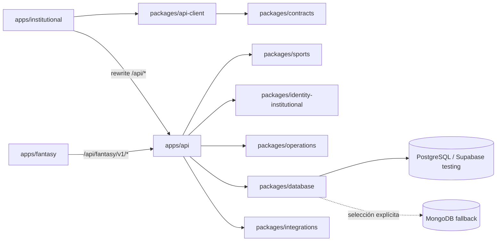

# Arquitectura del monorepo LUFA

## Contexto y límites

La plataforma separa despliegue, presentación y reglas de negocio sin duplicar la base de datos. `apps/api` es el límite de seguridad: sólo esta aplicación recibe secretos de base de datos, SMTP, Blob y Google. Los frontends reciben URLs públicas y consumen DTOs.



## Composition root

`apps/api/src/bootstrap/serviceContainer.ts` es el único lugar donde el transporte HTTP construye servicios. Los Route Handlers consumen instancias del container y conservan sus paths y envelopes JSON. Nuevas dependencias deben entrar por constructor o puerto; un handler no debe instanciar servicios ni importar modelos.

## Persistencia

El schema y el historial de migraciones viven en `packages/database/prisma`. Moverlos no genera una migración. `DATABASE_PROVIDER` se evalúa al seleccionar adapters; un fallo de PostgreSQL se propaga y nunca cambia automáticamente a MongoDB.

Configuración de testing:

```env
APP_ENV=testing
DATABASE_PROVIDER=postgres
DATABASE_URL=...
DIRECT_URL=...
```

El fallback requiere las tres decisiones explícitas: `DATABASE_PROVIDER=mongodb`, `MONGODB_URI` y `MONGODB_DATABASE=test`.

## Sesiones

La identidad institucional conserva la cookie host-only `lufa_session`. Fantasy usa una identidad independiente y la cookie host-only `fantasy_session`; no comparte credenciales, tablas de usuario ni sesiones institucionales.

## Builds

Cada app se compila desde su workspace y no necesita una conexión viva a la base durante build. El sitemap institucional es dinámico y obtiene recursos desde la API en runtime. Los crons y `/api/health` pertenecen al proyecto API.

## Reglas de evolución

1. Los contratos públicos no contienen modelos Prisma/Mongoose.
2. Los frontends no importan database, repositories ni servicios backend.
3. El dominio deportivo no importa Next.js, Prisma, Mongoose ni variables de entorno.
4. Todo nuevo endpoint actualiza contratos, tests y la línea base de paridad deliberadamente.
5. El primer caso de uso Fantasy creará su paquete de dominio; no se mantienen paquetes vacíos.
